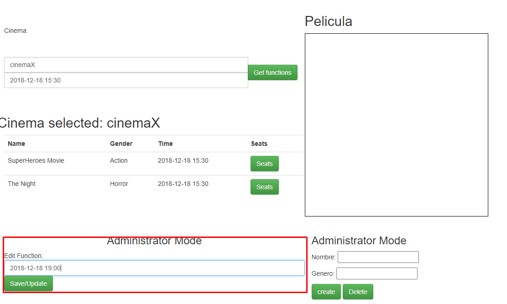
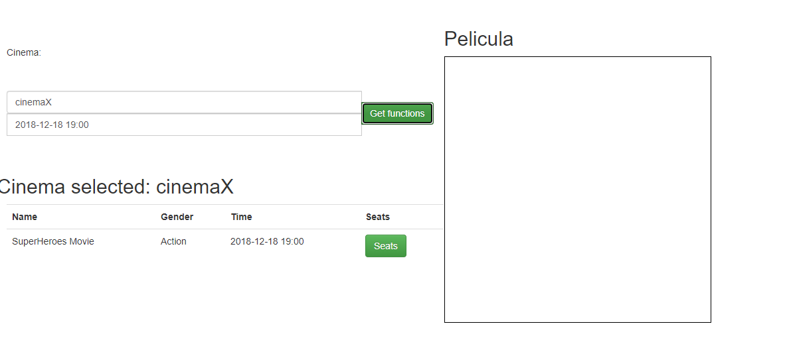
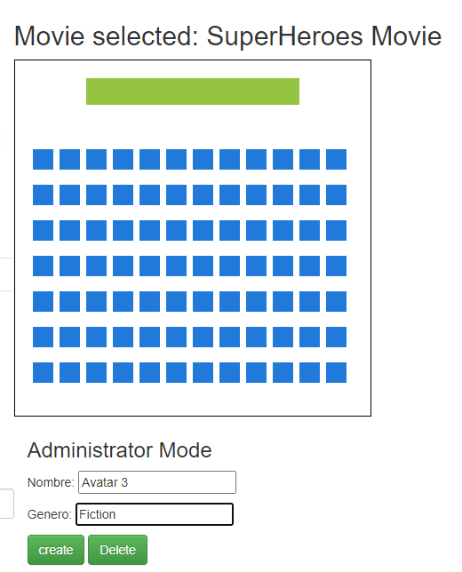
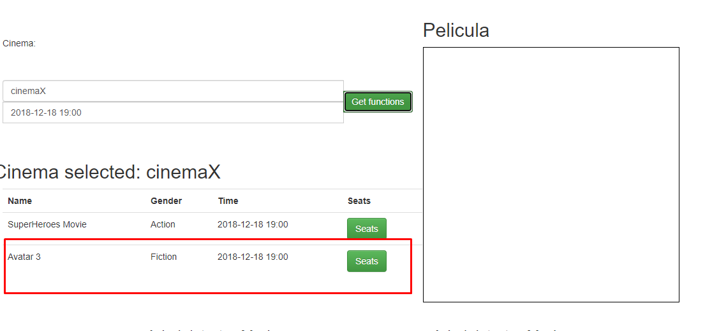
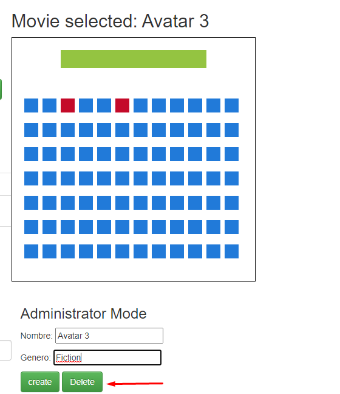
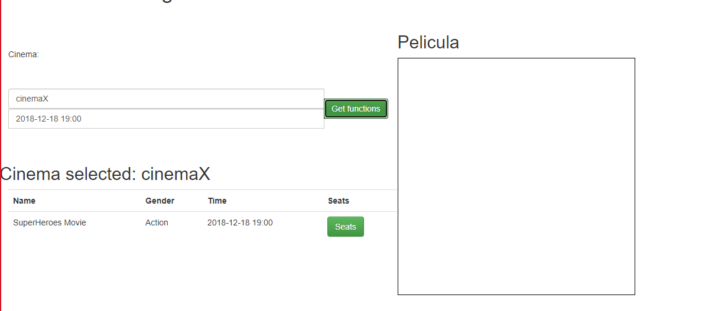

# Laboratorio No 6 
### David Andres Herrera Moya
### Cesar David Villamil Ramos

1. Agregue el campo de entrada para editar el horario de la función y el botón 'Save/Update'. Respetando la arquitectura de módulos actual del cliente, haga que al oprimirse el botón:

> 
>
>Y procedemos a probar que al momento de consultar las funciones se haya creado la funcion con la nueva hora:
>
> 
>
>
>Agregue el botón 'Create new function', de manera que cuando se oprima:
>
>
>
> Y procedemos a verificar que si creo la función:
>
> 
>
>Por ultimo el boton delete:
>
>
>
>Y comprobamos que la haya borrado:
>
> 